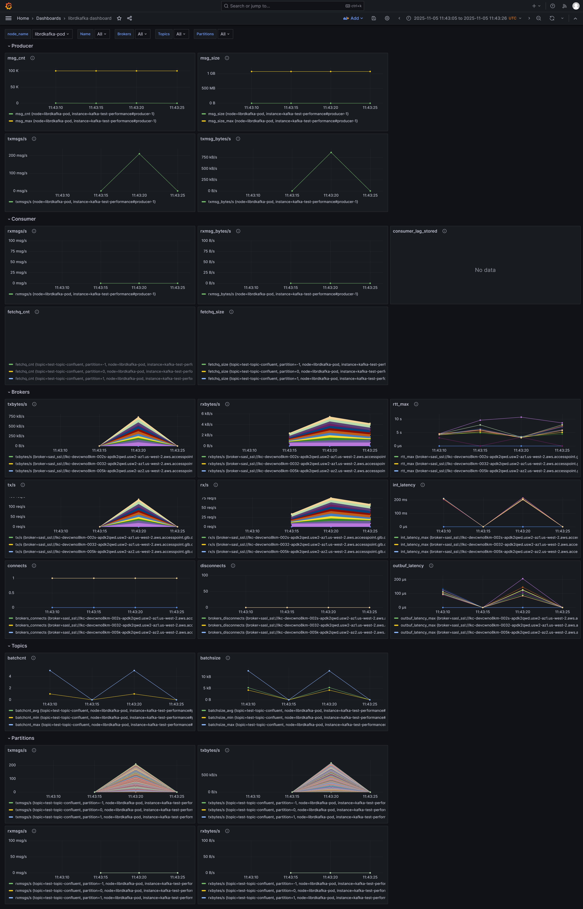

# Grafana dashboard for librdkafka stats

This Grafana dashboard allows to show metrics created from a series of librdkafka json stats, collected from a text file.

Every line that looks like a librdkafka stats JSON is parsed and the corresponding metrics are put into a SQLite DB.

Then a Grafana instance is started with a dashboard that queries those metrics, as soon as it's started the corresponding dashboard url
is opened.

> **_NOTE:_**  The dashboard uses the SQLite plugin for Grafana, later it can be modified to use PromQL and be reused for real time monitoring.

> **_NOTE:_**  When mixing stats from different processes the instance name can be the same. To differentiate them, one can put in the same line a process id enclosed by the `####` separator e.g.: `####process 1####`.

Default password is `librdkafka:librdkafka`

## Requirements

* Python 3
* Docker

## How to run

1. Generate the DB

```
./run.sh <text_file_to_parse.log>
```

2. Later checks

```
./run.sh
```

## Preview


